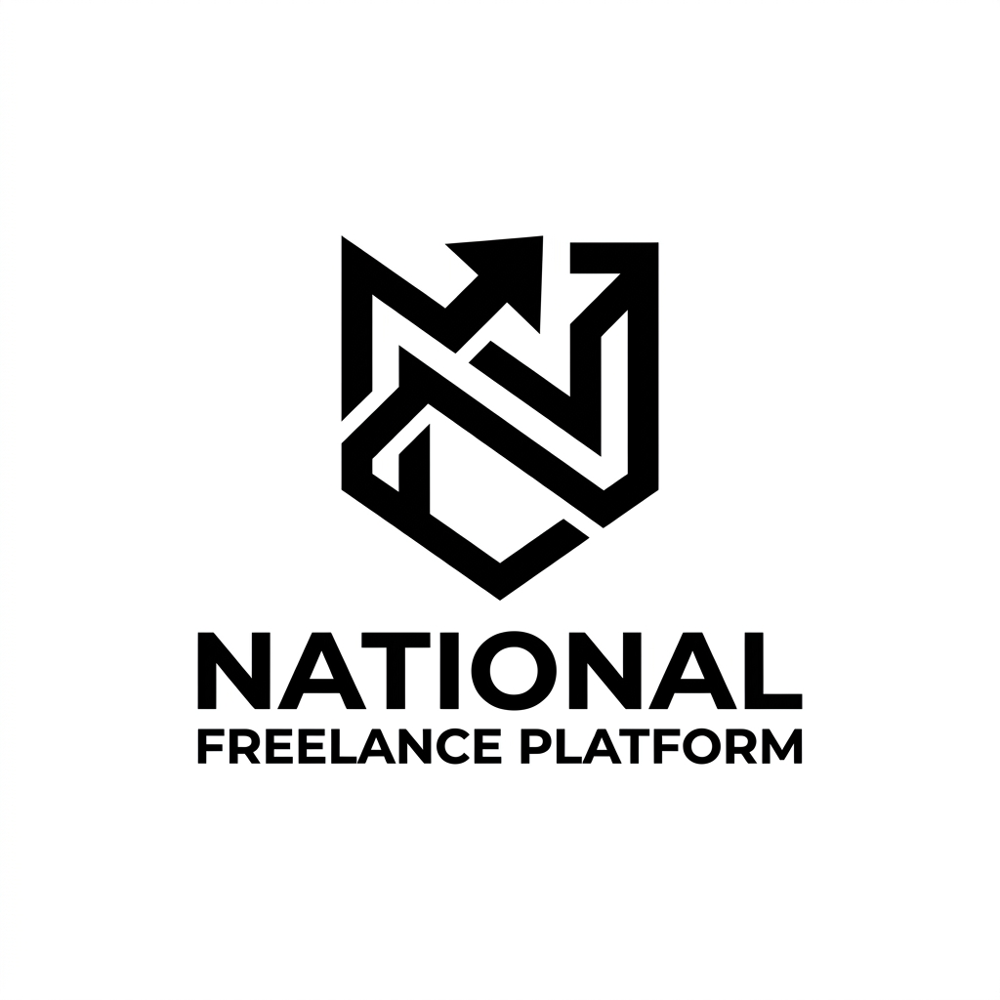

# National Freelance Platform - Module 5: Collaboration & Workspace



## Overview
The **National Freelance Platform (NFP)** is a state-of-the-art ecosystem designed to empower freelancers and project owners. **Module 5: Collaboration & Team Workspace** is the strategic core of the platform, providing the infrastructure for real-time task management, secure team communications, and centralized file organization.

This module focuses on high-impact collaboration through a tactical, industrial-grade user interface, ensuring that complex project hierarchies remain manageable and secure.

---

## 🏗️ System Architecture

The project is architected as a decoupled Full-Stack application:

- **Frontend**: A high-performance Single Page Application (SPA) built with **React**, **Vite**, and **Tailwind CSS**. It features a custom B&W tactical design system.
- **Backend**: A scalable RESTful API built with **Node.js** and **Express**, utilizing **PostgreSQL** for primary relational data and **SQLite** for high-speed local file metadata caching.

---

## 📂 Project Structure

```bash
.
├── backend/            # Express API Server (Node.js)
├── frontend/           # React Client (Vite)
├── database/           # SQL Schemas and Master Data (files.db, schema.sql)
└── uploads/            # Local storage for collaboration assets
```

---

## 🚀 Quick Start

### Prerequisites
- **Node.js** (v18+ recommended)
- **PostgreSQL** (Active instance)
- **npm** or **yarn**

### Installation

1. **Clone the Repository**
   ```bash
   git clone <repository-url>
   cd Module5-Collaboration-Workspace
   ```

2. **Backend Setup**
   ```bash
   cd backend
   npm install
   cp .env.example .env  # Configure your database credentials
   npm run dev
   ```

3. **Frontend Setup**
   ```bash
   cd ../frontend
   npm install
   npm run dev
   ```

---

## 🛡️ Key Features

- **Strategic Task Board**: Multi-stage Kanban system with priority matrix.
- **Personnel Hub**: Advanced role-based access control (RBAC) and team auditing.
- **Secure Communications**: Real-time workspace chat with media integration.
- **Asset Management**: Centralized file storage with versioning support.
- **Activity Auditing**: Full transparency with the Strategic Activity Log.

---

## 👥 Development Team

- **Uzair Majeed (23I-3063)** - Lead Developer
- **Rizwan Saeed (23I-3009)** - Core Developer
- **Maryam Farooq (23I-3005)** - UI/UX Designer
- **Zaki Haider (23I-3091)** - UI/UX Designer

---

## 📄 License
Internal use only for the National Freelance Platform project.
